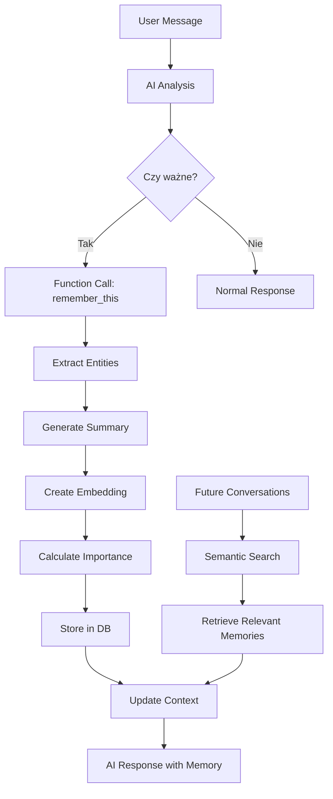

# TALK2Me - Architektura Systemu Pamięci

## 🧠 Przegląd Systemu

System pamięci TALK2Me to zaawansowany mechanizm pozwalający AI zapamiętywać i wykorzystywać informacje o użytkowniku i jego relacjach. Używa embeddings, semantic search i inteligentnej kategoryzacji.

## 📊 Flow Danych



## 🗂️ Typy Pamięci

### 1. **Identity** (Tożsamość)
- Imiona i relacje (np. "Mój mąż Maciej")
- Role życiowe (np. "Jestem mamą dwójki dzieci")
- Podstawowe info (wiek, zawód, miejsce zamieszkania)
- **Importance**: 8-10

### 2. **Preference** (Preferencje)
- Co lubi/nie lubi
- Ulubione rzeczy
- Dietary restrictions
- **Importance**: 5-7

### 3. **Experience** (Doświadczenia)
- Wydarzenia z przeszłości
- Ważne historie
- Traumy i sukcesy
- **Importance**: 6-9

### 4. **Emotion** (Emocje)
- Uczucia wobec osób/sytuacji
- Emotional triggers
- Reakcje emocjonalne
- **Importance**: 7-9

### 5. **Routine** (Rutyna)
- Codzienne zwyczaje
- Harmonogram
- Nawyki
- **Importance**: 4-6

### 6. **Goal** (Cele)
- Aspiracje
- Plany na przyszłość
- Rzeczy do zrobienia
- **Importance**: 6-8

### 7. **Boundary** (Granice)
- Czego nie lubią
- Triggery
- Hard limits
- **Importance**: 9-10

## 🔍 Extraction Rules

```javascript
// Przykładowe reguły ekstrakcji
const EXTRACTION_PATTERNS = {
    identity: [
        /mój (mąż|żona|partner|partnerka) (\w+)/i,
        /nazywam się (\w+)/i,
        /jestem (\w+)/i
    ],
    preference: [
        /(lubię|kocham|uwielbiam) (.+)/i,
        /(nie lubię|nie znoszę|nienawidzę) (.+)/i,
        /moim ulubionym (.+) jest (.+)/i
    ],
    experience: [
        /kiedy byłem (.+)/i,
        /pamiętam jak (.+)/i,
        /(.+) lat temu (.+)/i
    ],
    emotion: [
        /czuję się (.+)/i,
        /jestem (szczęśliwy|smutny|zły|przestraszony)/i,
        /to sprawia że (.+)/i
    ]
};
```

## 📈 Importance Scoring

```typescript
interface ImportanceFactors {
    explicitImportance: number;  // "To jest bardzo ważne" = +3
    emotionalWeight: number;     // Emotional language = +2
    repetition: number;          // Mentioned before = +1
    recency: number;            // Recent = +1
    relationshipMention: number; // About partner/family = +2
}

function calculateImportance(factors: ImportanceFactors): number {
    const baseScore = 5;
    const totalBonus = Object.values(factors).reduce((a, b) => a + b, 0);
    return Math.min(10, baseScore + totalBonus);
}
```

## 🔮 Semantic Search

### Embedding Generation
```python
# Używamy OpenAI text-embedding-ada-002
def generate_embedding(text: str) -> List[float]:
    response = openai.Embedding.create(
        input=text,
        model="text-embedding-ada-002"
    )
    return response['data'][0]['embedding']  # 1536 dimensions
```

### Search Strategy
```sql
-- Wyszukiwanie z wagami
WITH ranked_memories AS (
    SELECT 
        *,
        1 - (embedding <=> query_embedding) as similarity,
        -- Recency boost
        CASE 
            WHEN accessed_at > NOW() - INTERVAL '7 days' THEN 0.1
            WHEN accessed_at > NOW() - INTERVAL '30 days' THEN 0.05
            ELSE 0
        END as recency_boost,
        -- Importance weight
        importance / 10.0 as importance_weight
    FROM memories
    WHERE user_id = $1 AND deleted_at IS NULL
)
SELECT * FROM ranked_memories
WHERE similarity > 0.7
ORDER BY 
    (similarity + recency_boost) * importance_weight DESC
LIMIT 10;
```

## 💾 Storage Strategy

### Memory Lifecycle
1. **Creation**: Function call → Extract → Embed → Store
2. **Access**: Search → Retrieve → Update access_count
3. **Update**: Consolidate similar memories
4. **Expiry**: Auto-expire low importance after 90 days
5. **Deletion**: Soft delete → Hard delete after 30 days

### Optimization
```sql
-- Partitioning by user_id hash (future)
CREATE TABLE memories_partition_0 PARTITION OF memories
FOR VALUES WITH (modulus 4, remainder 0);

-- Automatic cleanup
CREATE OR REPLACE FUNCTION cleanup_old_memories()
RETURNS void AS $$
BEGIN
    -- Soft delete old, low-importance memories
    UPDATE memories 
    SET deleted_at = NOW()
    WHERE importance < 4 
        AND accessed_at < NOW() - INTERVAL '90 days'
        AND deleted_at IS NULL;
        
    -- Hard delete after grace period
    DELETE FROM memories
    WHERE deleted_at < NOW() - INTERVAL '30 days';
END;
$$ LANGUAGE plpgsql;
```

## 🔐 Privacy & Security

### Encryption Plan
```typescript
// Future: Client-side encryption
interface EncryptedMemory {
    content_encrypted: string;      // AES-256-GCM
    summary_encrypted: string;      // AES-256-GCM
    embedding: number[];           // Unencrypted for search
    encryption_key_id: string;     // Key rotation support
}
```

### Access Control
- User can only access own memories
- Admin can view stats but not content
- Audit log for all access
- Rate limiting on saves

## 🎯 Integration z Chat

### System Prompt Enhancement
```typescript
function buildSystemPrompt(memories: Memory[]): string {
    const contextSections = {
        identity: memories.filter(m => m.type === 'identity'),
        preferences: memories.filter(m => m.type === 'preference'),
        recent: memories.filter(m => m.type === 'experience').slice(0, 3)
    };
    
    return `
You are a relationship communication assistant with memory.

## User Context:
${contextSections.identity.map(m => `- ${m.summary}`).join('\n')}

## Preferences:
${contextSections.preferences.map(m => `- ${m.summary}`).join('\n')}

## Recent Topics:
${contextSections.recent.map(m => `- ${m.summary}`).join('\n')}

Remember to reference this context naturally in conversation.
    `;
}
```

### Function Calling
```typescript
const memoryFunction = {
    name: "remember_this",
    description: "Save important information about the user or their relationships",
    parameters: {
        type: "object",
        properties: {
            content: {
                type: "string",
                description: "The exact information to remember"
            },
            memory_type: {
                type: "string",
                enum: ["identity", "preference", "experience", "emotion", "routine", "goal", "boundary"]
            },
            importance: {
                type: "integer",
                minimum: 1,
                maximum: 10,
                description: "How important is this information (1-10)"
            },
            entities: {
                type: "object",
                description: "Extracted entities (names, dates, etc)"
            }
        },
        required: ["content", "memory_type", "importance"]
    }
};
```

## 📊 Monitoring & Analytics

### Key Metrics
```sql
-- Memory health per user
CREATE VIEW memory_health AS
SELECT 
    user_id,
    COUNT(*) as total_memories,
    AVG(importance) as avg_importance,
    COUNT(*) FILTER (WHERE accessed_at > NOW() - INTERVAL '7 days') as recently_accessed,
    COUNT(*) FILTER (WHERE memory_type = 'identity') / COUNT(*)::float as identity_ratio,
    MAX(created_at) as last_memory_created
FROM memories
WHERE deleted_at IS NULL
GROUP BY user_id;
```

### Performance Monitoring
- Embedding generation time: < 200ms
- Search latency: < 100ms
- Storage per user: ~1MB per 1000 memories
- Index size: ~20% of table size

## 🚀 Roadmap

### Phase 1 (Current)
- ✅ Basic memory storage
- ✅ Semantic search
- ✅ Function calling integration
- ⏳ Production deployment

### Phase 2
- [ ] Memory consolidation
- [ ] Cross-conversation learning
- [ ] Pattern detection
- [ ] Relationship graph

### Phase 3
- [ ] Client-side encryption
- [ ] Memory sharing between users
- [ ] Export/import memories
- [ ] Advanced analytics

## 🔧 Konfiguracja

### Environment Variables
```bash
# Memory system
MEMORY_ENABLED=true
MEMORY_IMPORTANCE_THRESHOLD=5
MEMORY_MAX_PER_CONVERSATION=50
MEMORY_EMBEDDING_MODEL=text-embedding-ada-002
MEMORY_SEARCH_THRESHOLD=0.7
MEMORY_SEARCH_LIMIT=10

# OpenAI
OPENAI_API_KEY=sk-...
OPENAI_EMBEDDING_ENDPOINT=https://api.openai.com/v1/embeddings
```

### Database Indexes
```sql
-- Critical for performance
CREATE INDEX CONCURRENTLY idx_memories_embedding ON memories 
USING ivfflat (embedding vector_cosine_ops)
WITH (lists = 100);

-- Maintenance
REINDEX INDEX CONCURRENTLY idx_memories_embedding;
ANALYZE memories;
```

---

*System pamięci jest sercem TALK2Me - pozwala budować głębokie, spersonalizowane relacje z AI.*